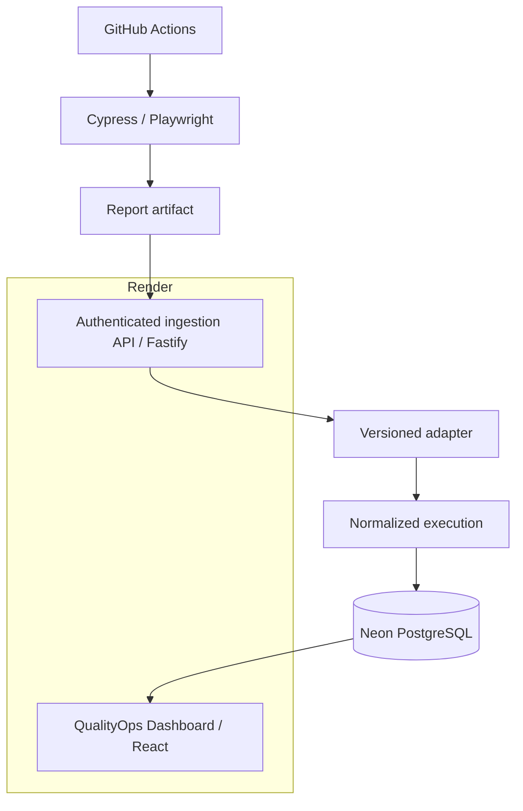
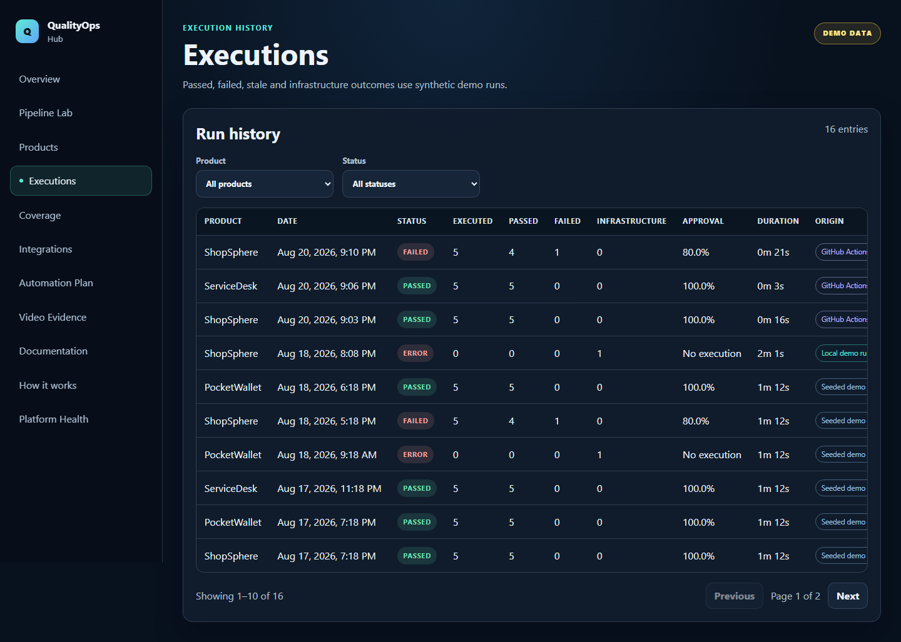
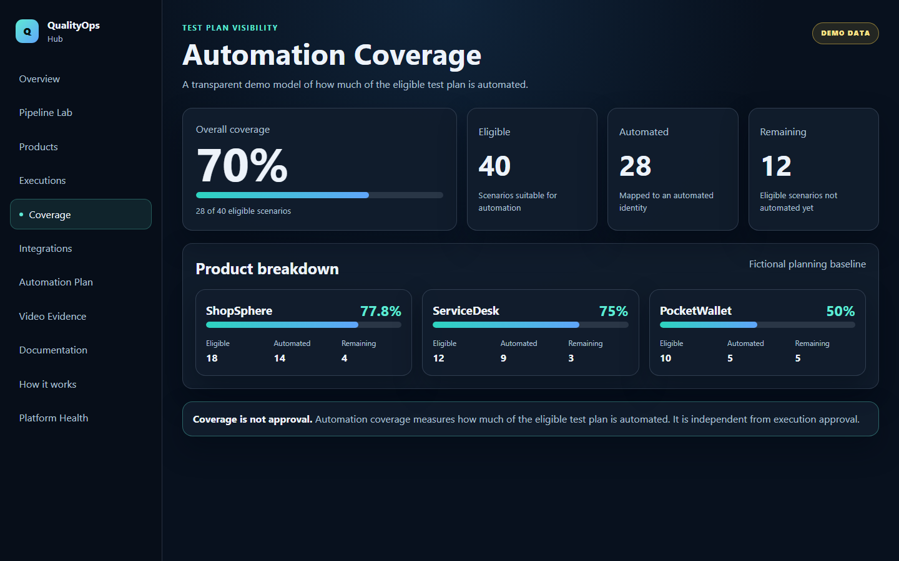
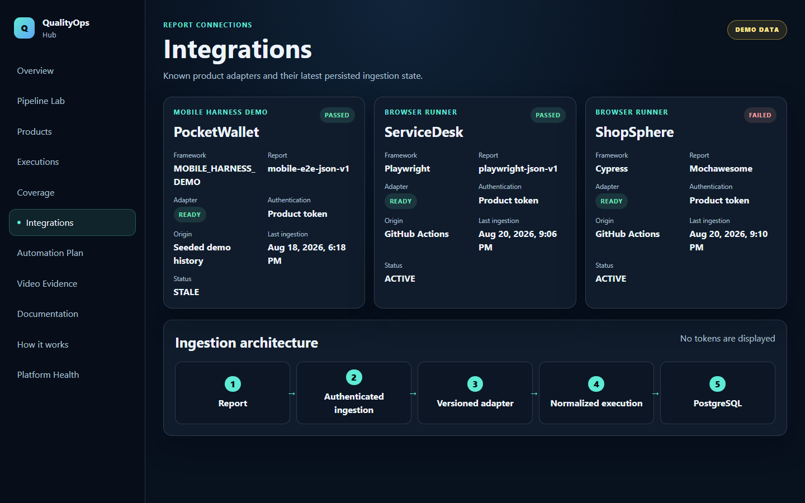

# QualityOps Hub

**Open-source TestOps portfolio platform that normalizes CI test reports into traceable quality metrics, history, and regression signals.**

**Live Demo:** [qualityops-hub.onrender.com](https://qualityops-hub.onrender.com)<br>
**Architecture:** React + Fastify on Render, PostgreSQL on Neon, browser automation in GitHub Actions<br>
**CI Status:** [](https://github.com/luanaabastos/qualityops-hub/actions/workflows/platform.yml)

`v1.0.0 release candidate` · [MIT](LICENSE) · Node.js `20.20.1` · pnpm `10.34.5`

> Every product, test, execution, and metric in this project is fictional and synthetic.

## Problem and solution

Automated-test results are commonly fragmented across CI jobs, framework reports, artifacts, logs, and historical runs. Answering whether quality improved or regressed then requires manual reconciliation across tools and formats.

QualityOps Hub provides one bounded path from report to decision-ready evidence:

- versioned adapters normalize framework-specific reports;
- PostgreSQL keeps a traceable execution history;
- quality metrics separate assertions from infrastructure errors;
- Regression Delta compares stable scenario identities over time;
- pipeline metadata connects the dashboard back to the originating CI evidence.

It complements CI rather than replacing it: CI executes the tests; QualityOps Hub explains their results over time.

## Live Demo

[https://qualityops-hub.onrender.com](https://qualityops-hub.onrender.com)

- Render Free may require a cold start before the first response.
- All products and data are fictional.
- Real Cypress and Playwright browser automation runs in GitHub Actions.
- Neon PostgreSQL persists the normalized results.
- The hosted Pipeline Lab is a non-persisting flow preview and does not create official evidence.

The latest official product runs produce **10 executed, 9 passed, 1 failed, 0 infrastructure errors, 90% approval, and a 90% Quality Score**.

## Real CI Evidence

These public proof runs preserve the real framework report as a GitHub Actions artifact before authenticated ingestion into the hosted API.

| Scenario | Framework | Executed | Passed | Failed | Workflow | Artifact | Dashboard execution |
|---|---|---:|---:|---:|---|---|---|
| ShopSphere — success | Cypress / Mochawesome | 5 | 5 | 0 | [Run 32431118788](https://github.com/luanaabastos/qualityops-hub/actions/runs/32431118788) | [Mochawesome report](https://github.com/luanaabastos/qualityops-hub/actions/runs/32431118788/artifacts/9429101193) | [Execution](https://qualityops-hub.onrender.com/executions/a8a65b5d-17b2-4714-b3c1-d2192b945963) |
| ServiceDesk — success | Playwright / `playwright-json-v1` | 5 | 5 | 0 | [Run 32431321053](https://github.com/luanaabastos/qualityops-hub/actions/runs/32431321053) | [Playwright report](https://github.com/luanaabastos/qualityops-hub/actions/runs/32431321053/artifacts/9429173727) | [Execution](https://qualityops-hub.onrender.com/executions/6899dec4-d7d6-4fe9-ba89-7edf30b88d1c) |
| ShopSphere — functional failure | Cypress / Mochawesome | 5 | 4 | 1 | [Expected failed run 32431559619](https://github.com/luanaabastos/qualityops-hub/actions/runs/32431559619) | [Mochawesome report](https://github.com/luanaabastos/qualityops-hub/actions/runs/32431559619/artifacts/9429251422) | [Execution](https://qualityops-hub.onrender.com/executions/af12fdee-6860-4916-a35c-9fce60022556) |

The functional-failure workflow intentionally finishes red only after its report is preserved and ingested. ShopSphere then reports one new failure in Regression Delta.

## Architecture



GitHub Actions runs browser automation and retains the raw artifacts. Fastify validates authenticated report envelopes, a versioned adapter maps each accepted format into a common model, and Neon persists the normalized history. Render hosts the same-origin React application and API.

## Features

- Multi-framework report normalization for Mochawesome, `playwright-json-v1`, and `mobile-e2e-json-v1`.
- Authenticated ingestion with isolated product-scoped tokens.
- Idempotent report replay and HTTP 409 for conflicting content at the same identity.
- Historical executions with traceable workflow, job, artifact, branch, and commit metadata.
- Approval Rate, Quality Score, Automation Coverage, freshness, and infrastructure-error semantics.
- Regression Delta for new, recovered, persistent, added, and removed tests.
- Execution Details with sanitized diagnostics.
- Pipeline Lab with strict allow-listed local runners and a separate hosted-preview mode.
- Health and readiness endpoints.
- Responsive portfolio UI with keyboard-accessible navigation.

## Tech stack

| Area | Technology |
|---|---|
| Frontend | React, TypeScript, Vite |
| Backend | Fastify, TypeScript |
| Validation | Zod |
| Database | PostgreSQL / Neon |
| Automation | Cypress, Playwright |
| CI | GitHub Actions |
| Container | Docker |
| Hosting | Render |

## Engineering Decisions

- **Versioned adapters:** framework parsing stays outside HTTP routes and domain metrics, so a report format can evolve without changing the normalized model.
- **Normalized execution model:** Cypress, Playwright, and the mobile harness become comparable without discarding framework, suite, case, or pipeline traceability.
- **Product-scoped tokens:** each integration receives only the ingestion boundary for its own fictional product.
- **Idempotency:** CI retries can safely return the original execution, while conflicting content for the same identity is rejected.
- **External CI for browsers:** Render Free hosts the UI/API; GitHub Actions provides the resources and retained artifacts for real Cypress and Playwright runs.
- **Preview is not evidence:** hosted preview demonstrates state transitions but cannot affect official metrics or create an execution.

## Security

- Raw integration tokens are shown once; PostgreSQL stores salted scrypt hashes.
- Tokens are isolated by product and raw secrets never belong in report payloads.
- Pipeline Lab maps enums to fixed runner files, uses bounded execution, and accepts no arbitrary commands or paths.
- Production uses a same-origin hosted architecture and defensive HTTP headers.
- Zod validates bounded report bodies; SQL calls are parameterized and ingestion is transactional.
- Repository, history, identity, path, asset, corporate-reference, and secret scans protect the public surface.

See [SECURITY.md](SECURITY.md) and the [security design notes](docs/security.md).

## Screenshots

| Overview | Pipeline Lab |
|---|---|
|  |  |

| Executions | Regression Delta |
|---|---|
|  |  |

| Coverage | Integrations |
|---|---|
|  |  |

## Current Limitations

- PocketWallet is a deterministic Mobile Harness Demo, not a real Android device run.
- Object storage is not enabled; GitHub Actions retains external-CI reports and local raw reports remain disposable ignored artifacts.
- Render Free may introduce a cold start.
- The application has no user authentication, roles, or multi-tenancy.
- The portfolio dataset, products, users, tests, and planning model are synthetic.
- Background demo jobs use an in-process queue with no distributed recovery.
- Video Evidence is a clearly labeled concept preview without upload or persistent storage.

## Getting started

### Prerequisites

- Node.js `20.20.1`
- pnpm `10.34.5`
- Docker with Compose

### Quick start

```bash
pnpm install --frozen-lockfile
pnpm demo:start
pnpm demo:status
```

Open `http://localhost:5173`. The local experience uses only fictional demo configuration; no hosted secret is required.

Stop only the project services with:

```bash
pnpm demo:stop
```

Detailed setup and safe reset instructions are in [docs/development.md](docs/development.md).

## Validation

```bash
pnpm install --frozen-lockfile
pnpm lint
pnpm typecheck
pnpm test
pnpm build
pnpm test:e2e
pnpm test:production
pnpm scan:references
pnpm scan:secrets
pnpm scan:public
```

Unit tests cover shared quality semantics and report adapters. PostgreSQL integration tests cover authentication, supported formats, token isolation, idempotent replay, conflicts, and feature boundaries. Playwright covers local pipelines, primary views, pagination, responsive overflow, and mobile keyboard navigation.

## Documentation

- [Architecture](docs/architecture.md)
- [Report adapters](docs/adapters.md)
- [Report contract](docs/test-report-contract.md)
- [GitHub Actions ingestion](docs/github-actions.md)
- [Hosting](docs/hosting.md)
- [Security](docs/security.md)
- [Roadmap](docs/roadmap.md)
- [v1.0.0 release notes](docs/releases/v1.0.0.md)
- [Portfolio case study](docs/portfolio/case-study.md)

## Release status

The codebase is prepared as a **v1.0.0 release candidate**. No `v1.0.0` tag or GitHub Release is created until human approval.

## License and disclaimer

QualityOps Hub is available under the [MIT License](LICENSE).

QualityOps Hub is an independent portfolio project. ShopSphere, ServiceDesk, PocketWallet, their users, tests, pipelines, and all displayed data are fictional and synthetic. No real organization, proprietary product, enterprise system, client, or employer integration is represented.
