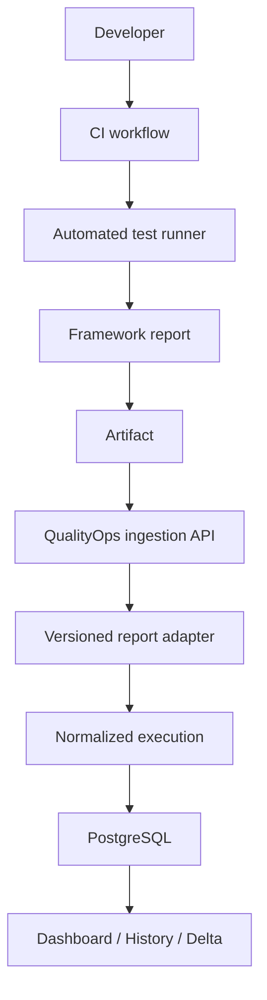
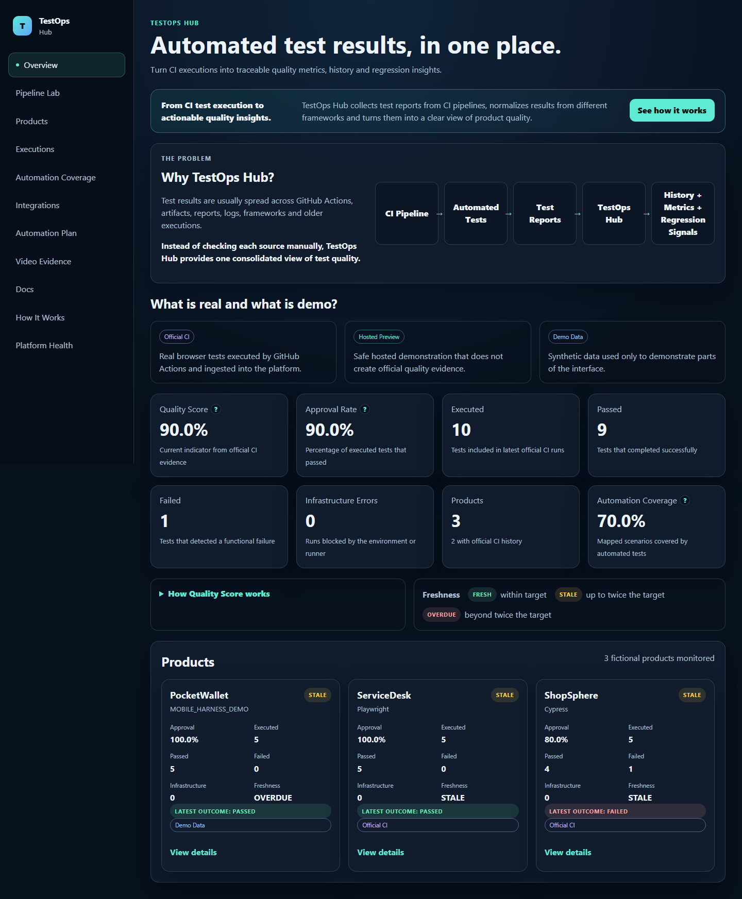
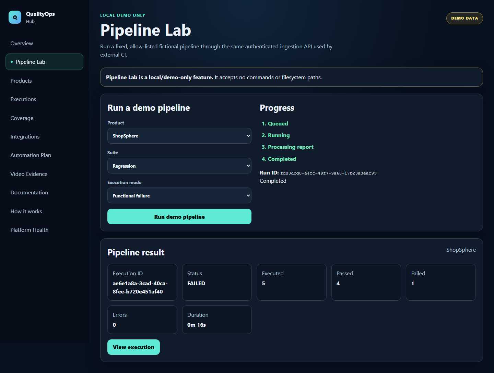
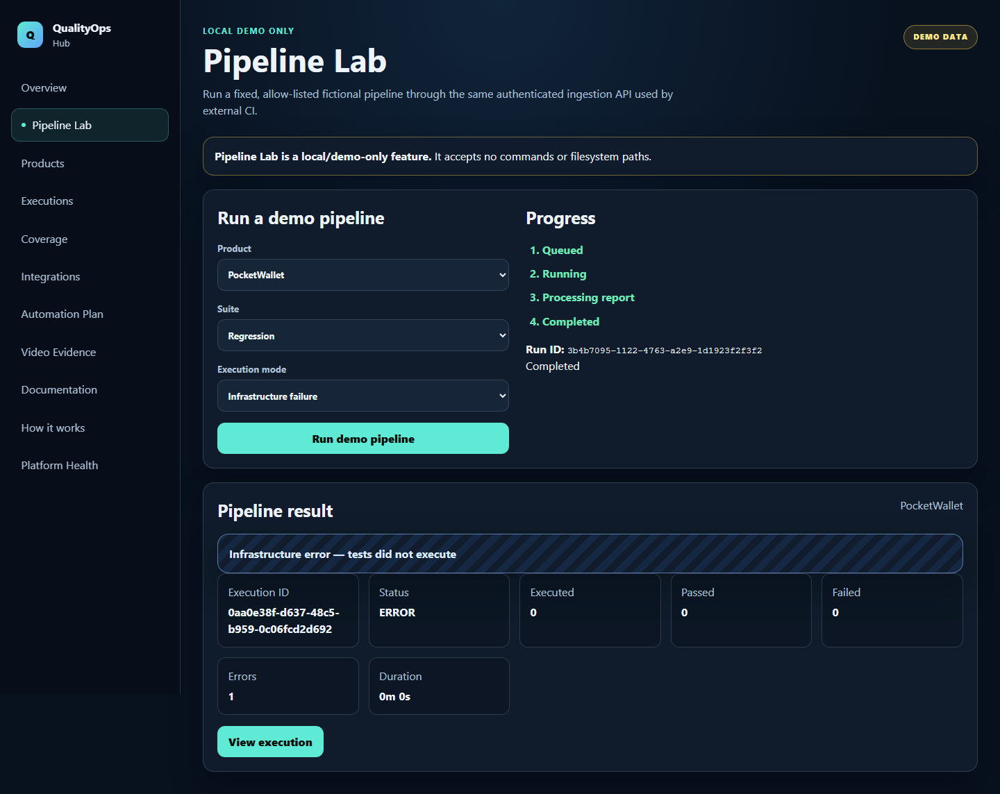
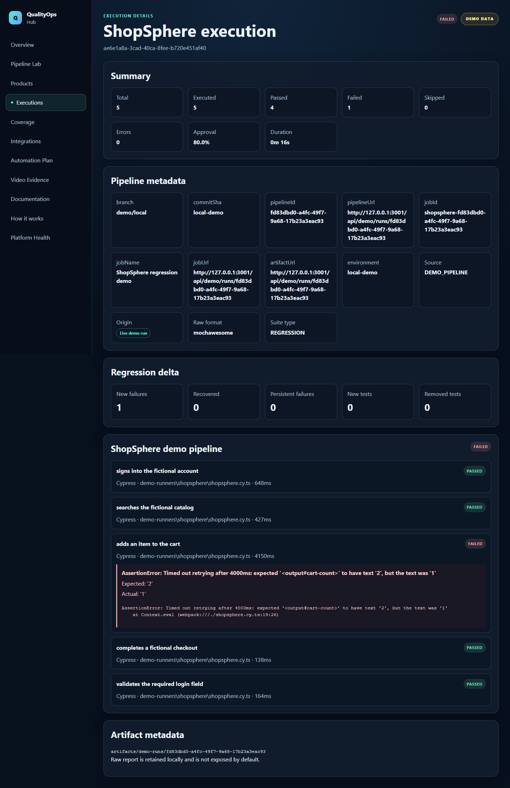
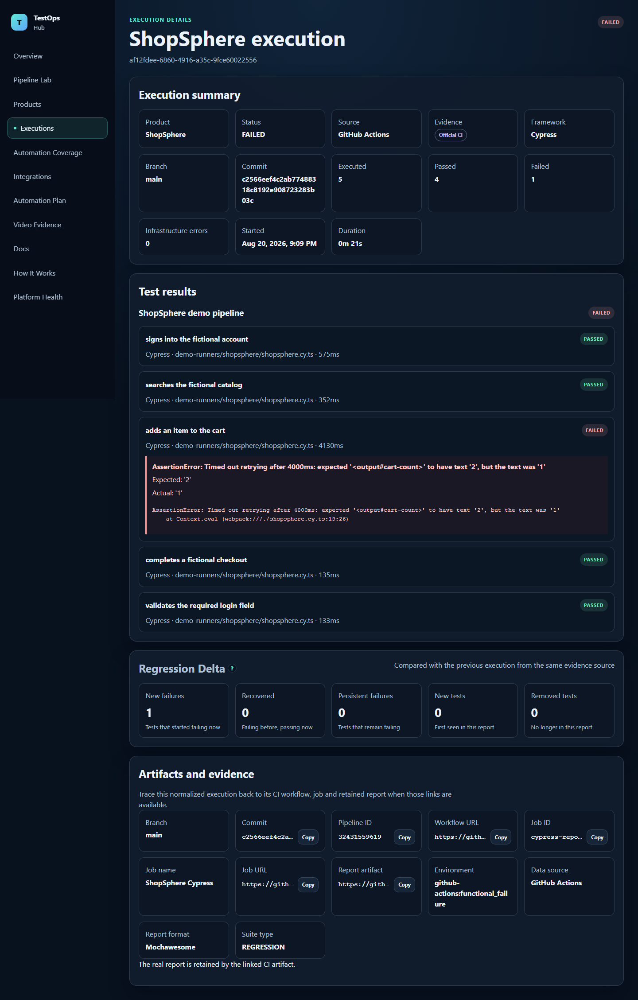

# QualityOps Hub

**Portfolio Preview** — a TestOps portfolio platform that turns automated-test reports into quality signals that can be compared over time.

License: [MIT](LICENSE)

`LICENSE=MIT`

## Live Demo

Live demo: [https://qualityops-hub.onrender.com](https://qualityops-hub.onrender.com)

The public portfolio demo runs the UI/API on Render Free and persists history in Neon PostgreSQL. Browser-heavy Cypress and Playwright execution is intentionally kept outside the small hosted web service; until external CI ingestion is configured, the hosted Pipeline Lab is labeled as a preview and creates no official execution. See [the hosting guide](docs/hosting.md).

> CI tells you that tests ran. QualityOps Hub helps you understand what those runs mean over time.

## Why this project exists

Quality engineers often move between CI jobs, framework-specific reports, artifacts, spreadsheets, and screenshots to answer a simple question: did product quality improve or regress? That context becomes fragmented as projects use different runners and report formats.

QualityOps Hub explores a single, auditable path from test execution to a historical quality view. It is intentionally a focused portfolio project, not a replacement for a CI platform.

## The idea

CI executes tests. QualityOps Hub receives the resulting report, validates it, normalizes it, stores it, compares it with the previous execution, and visualizes the outcome.

## What QualityOps Hub does

- Accepts product-scoped Bearer-authenticated test reports.
- Validates three explicit, versioned report formats.
- Normalizes framework-specific results into one execution model.
- Separates functional failures from infrastructure errors.
- Persists executions, suites, cases, pipeline metadata, and deltas in PostgreSQL.
- Detects identical replays and conflicting content for the same pipeline identity.
- Runs real browser demonstrations locally and a clearly labeled, non-persisting flow preview on the hosted free tier.
- Shows overview, history, execution details, freshness, and Regression Delta views.
- Presents an explicit 28/40 fictional Automation Coverage model that is separate from execution approval.
- Provides a filterable Automation Plan preview and live adapter status for each fictional product.
- Includes concise in-app operating guides and an honest Video Evidence concept preview.

## Architecture



Framework parsing is isolated in adapters; the HTTP layer never contains runner-specific mapping logic. Local runners submit through the same authenticated ingestion boundary reserved for real external-CI reports in the hosted architecture.

## Demo products

### ShopSphere

A fictional e-commerce product. Its demo runner executes real Cypress browser tests and exports a real Mochawesome report.

### ServiceDesk

A fictional support portal. Its demo runner executes real Playwright browser tests and exports the versioned `playwright-json-v1` contract.

### PocketWallet

A fictional mobile product represented by `MOBILE_HARNESS_DEMO`. It demonstrates mobile-report normalization and a deliberate pre-execution infrastructure failure. It is not an Android device, Appium, or WebdriverIO run.

## Pipeline Lab

Pipeline Lab is the main interactive demonstration:

1. Start the local demo.
2. Open **Pipeline Lab**.
3. Select a fictional product.
4. Select Smoke or Regression.
5. Select success, functional failure, or infrastructure failure.
6. Run the pipeline.
7. Watch the queued, running, processing, and completed states.
8. Open the persisted execution.
9. Inspect the refreshed dashboard.
10. Open ShopSphere to inspect Regression Delta.

The API accepts enums only and maps them to fixed runner files. User input never becomes a command, executable, argument list, or filesystem path.

`DEMO_RUNNER_MODE=local` keeps this complete flow and executes the real Cypress, Playwright, or Mobile Harness Demo runner. `DEMO_RUNNER_MODE=hosted-preview` demonstrates queue and processing states without spawning Cypress/Playwright, fabricating reports, or adding an official execution. The public UI displays `EXTERNAL_CI_INTEGRATION_PENDING` until authenticated external CI ingestion is implemented.

## Portfolio views

- **Overview** explains Quality Score, Approval Rate, Automation Coverage, and freshness without combining their meanings.
- **Products and Executions** expose current outcomes, Regression Delta, bounded history, and copyable pipeline metadata.
- **Coverage** uses an explicit fictional planning baseline: 28 automated scenarios out of 40 eligible scenarios.
- **Automation Plan** provides representative, filterable scenario mappings; CSV/XLSX import remains planned.
- **Integrations** connects each product to its runner, report format, adapter, authentication model, and latest ingestion.
- **Documentation** provides concise in-app guides for automation, adapters, Pipeline Lab, and architecture.
- **Video Evidence** is clearly labeled as a demo preview. File upload and persistent object storage are not implemented.

## Report adapters

| Product | Runner | Accepted format |
|---|---|---|
| ShopSphere | Cypress | `mochawesome` |
| ServiceDesk | Playwright | `playwright-json-v1` |
| PocketWallet | Mobile Harness Demo | `mobile-e2e-json-v1` |

The normalized model preserves stable scenario identity, status, duration, sanitized diagnostics, pipeline metadata, and explicit execution counts. See [the adapter guide](docs/adapters.md) and [report contract](docs/test-report-contract.md).

## Regression Delta

Each new execution is compared with the latest previous execution for the same product using a stable test-case key. The UI reports new failures, recovered tests, persistent failures, new tests, and removed tests without guessing from display names alone.

## Infrastructure errors

Infrastructure errors are not counted as failed assertions. When a runner cannot start, the execution is stored as `ERROR` with `executed=0`, `failed=0`, and at least one infrastructure error. Approval and Quality Score remain unavailable because no test result exists.

## Security

- Raw integration tokens are displayed once; PostgreSQL stores a salted scrypt hash.
- Authentication uses product-scoped tokens and timing-safe comparison.
- Production uses same-origin frontend/API requests; local CORS defaults to the two development origins.
- Responses include defensive content, frame, referrer, and permissions headers.
- Report bodies are validated with Zod and limited to 10 MiB.
- SQL calls are parameterized and ingestion writes use transactions.
- Pipeline Lab is feature-flagged and strictly allow-listed. Local mode adds rate/cooldown/capacity limits and timed child processes without a shell; hosted-preview mode starts no child process.
- Stack traces and file paths are sanitized before persistence.
- Raw reports stay in ignored local artifacts and are not exposed by the API.

This is a bounded portfolio demo, not a multi-tenant production service. It has no distributed queue, external object storage, distributed rate limiting, user accounts, or analytics. See [SECURITY.md](SECURITY.md), [known risks](docs/security.md), and [hosted-demo limitations](docs/hosting.md).

## Local demo

### Prerequisites

- Node.js `20.20.1`
- pnpm `10.34.5`
- Docker with Compose
- Chromium dependencies supported by Playwright

[Volta](https://volta.sh/) is the recommended optional runtime manager because the exact Node and pnpm versions are pinned in `package.json`.

### Quick start

Start Docker, then run:

```bash
pnpm install --frozen-lockfile
pnpm demo:start
pnpm demo:status
```

Open `http://localhost:5173`.

Stop only the project demo services with:

```bash
pnpm demo:stop
```

Reset only the local `qualityops_dev` data and project demo artifacts, reseed the fictional history, and restart the demo with explicit confirmation:

```bash
pnpm demo:reset -- --confirm-local-demo-reset
```

The reset command refuses non-local hosts and any database name other than `qualityops_dev`. It does not prune Docker, delete the project volume, or touch external containers.

## Testing strategy

```bash
pnpm install --frozen-lockfile
pnpm lint
pnpm typecheck
pnpm test
pnpm build
pnpm test:e2e
pnpm test:production
pnpm scan:references
pnpm scan:secrets
pnpm scan:public
```

Unit tests cover shared quality semantics and adapters. PostgreSQL integration tests cover authentication, all report formats, idempotent replay, conflict handling, and feature flags. Playwright acceptance tests drive real local pipelines through the UI and verify persisted results.

## Screenshots

### Platform overview



### Pipeline Lab



### Infrastructure error



### Execution details



### Regression Delta



## Roadmap

Implemented capabilities and honest next milestones are tracked in [docs/roadmap.md](docs/roadmap.md). The next planned boundary is authenticated report ingestion from external CI; credentials and remote workflow configuration require a separate authorization.

## Project status

Status: **Portfolio Preview**.

The local application, database-backed ingestion, real local browser demo runners, portfolio-ready product views, evidence flow, and public hosted preview are implemented. External CI ingestion remains planned and is not represented as active.

## License

QualityOps Hub is available under the [MIT License](LICENSE).

## Disclaimer

QualityOps Hub is an independent portfolio project. ShopSphere, ServiceDesk, PocketWallet, their users, tests, pipelines, and all displayed data are fictional and synthetic. No real organization, proprietary product, enterprise system, or business integration is represented. PocketWallet is a deterministic Mobile Harness Demo, not a real Android-device execution.
