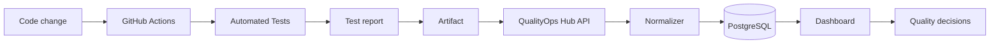

# Architecture

QualityOps Hub is intentionally designed as a synthetic platform that ingests framework-specific outputs, normalizes them and centralizes the history for engineering teams.

## Components

- Web app for dashboard and product overview
- API for ingestion and health endpoints
- Shared package for domain contracts and demo data
- PostgreSQL for persistence and auditing
- MinIO for object storage and evidence
- GitHub Actions for public demo workflows
