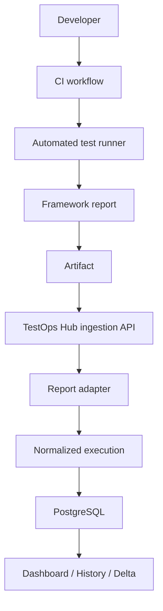

# Architecture

TestOps Hub is a small monorepo with a React client, Fastify API, shared Zod contracts, fixed local runners, and PostgreSQL. Framework parsing stays in versioned adapters and never enters the route handlers.

The hosted shape is one Node process: Fastify serves the compiled React assets and `/api` routes from the same origin. Development retains separate Vite and API processes for fast feedback. See [hosted demo readiness](hosting.md).



## Ingestion boundary

```text
POST /api/products/:productKey/test-reports
  -> product-scoped Bearer authentication
  -> versioned Zod report validation
  -> adapter normalization
  -> canonical identity and content hashes
  -> PostgreSQL transaction
  -> dashboard polling
```

The local runner never writes execution rows directly. It submits through the same API boundary intended for a future CI system.

## Persistence

The production start wrapper applies ordered SQL migrations and idempotent bootstrap before starting the API. The API also safely rechecks both prerequisites. Ingestion stores execution, pipeline metadata, suites, and cases in one transaction. Runtime integration tests use an isolated `qualityops_test` database.

## Background execution

`POST /api/demo/runs` creates a `QUEUED` job and returns immediately. An allow-listed, capacity-limited in-process worker advances through `RUNNING`, `PROCESSING_REPORT`, and `COMPLETED` or `FAILED`. Redis and distributed job recovery remain outside this single-instance portfolio milestone.

## Storage

PostgreSQL is the only persistent source of truth. Raw framework reports are ignored, disposable runtime artifacts. Object storage is not configured, and Platform Health presents it as not configured rather than healthy.

## Reliability semantics

Functional assertions produce `FAILED`. A runner that cannot begin produces `ERROR`, `executed=0`, `failed=0`, `errors>=1`, and no approval rate. Stable test identities combine framework, normalized file, suite path, and title.
