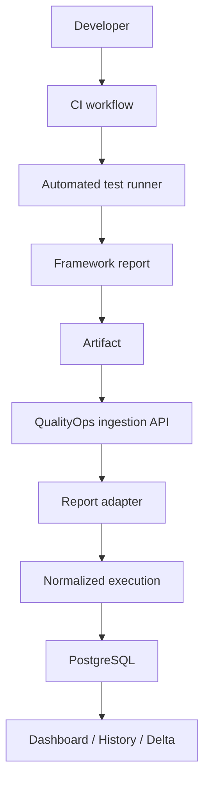

# Architecture

QualityOps Hub is a small monorepo with a React client, Fastify API, shared Zod contracts, fixed local runners, and PostgreSQL. Framework parsing stays in versioned adapters and never enters the route handlers.



## Ingestion boundary

```text
POST /api/products/:productKey/test-reports
  -> product-scoped Bearer authentication
  -> versioned Zod report validation
  -> adapter normalization
  -> canonical identity and content hashes
  -> PostgreSQL transaction
  -> dashboard polling
```

The local runner never writes execution rows directly. It submits through the same API boundary intended for a future CI system.

## Persistence

The API applies ordered SQL migrations on startup and uses parameterized `pg` queries. Ingestion stores execution, pipeline metadata, suites, and cases in one transaction. Products and synthetic history are seeded idempotently. Runtime integration tests use an isolated `qualityops_test` database.

## Background execution

`POST /api/demo/runs` creates a `QUEUED` job and returns immediately. An in-process worker advances through `RUNNING`, `PROCESSING_REPORT`, and `COMPLETED` or `FAILED`. Redis and distributed job recovery are intentionally outside the local portfolio milestone.

## Storage

PostgreSQL is the only active persistent service. Raw framework reports are retained as ignored local artifacts. Object storage is not configured, and Platform Health presents it as not configured rather than healthy.

## Reliability semantics

Functional assertions produce `FAILED`. A runner that cannot begin produces `ERROR`, `executed=0`, `failed=0`, `errors>=1`, and no approval rate. Stable test identities combine framework, normalized file, suite path, and title.
